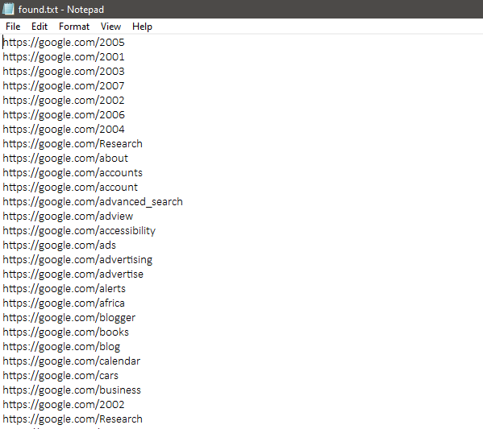

# dirbruteX

# 🚀 H4ck3rX - Directory Brute-Force Tool

Banner-Image

Output-Image

H4ck3rX is a powerful and customizable **directory brute-force scanner** written in Python. It’s designed for penetration testers and bug bounty hunters to enumerate hidden directories and files on web servers with style 😎.

---

## 🧠 Features

- 🧵 Multi-threaded scanning
- 🔁 Recursive directory brute-force
- 🧾 Add custom file extensions (`.php`, `.html`, `.bak`, etc.)
- 💾 Optional output to file
- 🔎 Ping and host validation before scan
- 🧑‍💻 Stylish and user-friendly CLI interface with `prompt_toolkit`
- 🚫 Skips 404s and unreachable hosts
- 🎨 Colorful console output

---

h4ck3rx/
│
├── h4ck3rx.py           # Main Python script
├── README.md            # This file
├── wordlists/           # Folder for custom wordlists
├── images/              # Screenshots or banner images
└── results/             # Output files (if saved)

✨ Author
Mohammed
🧠 Learning, building, hacking
📬 Feel free to connect!